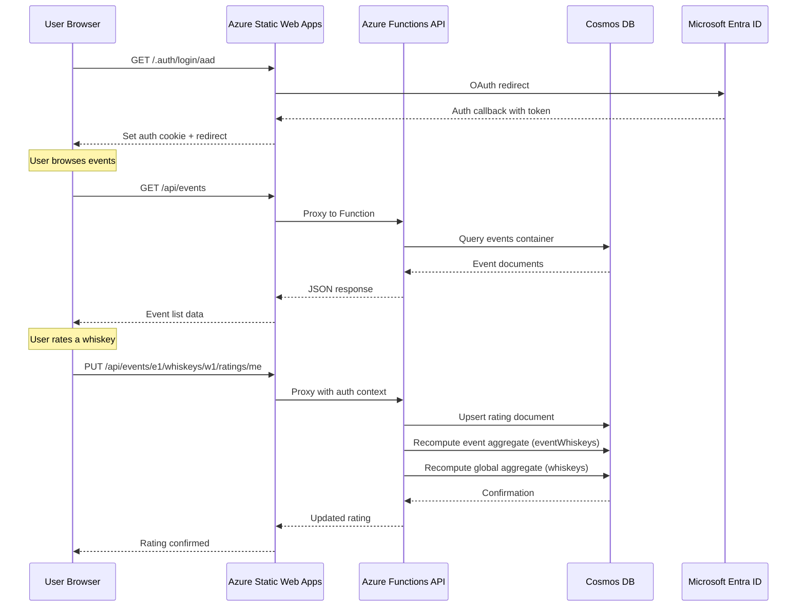
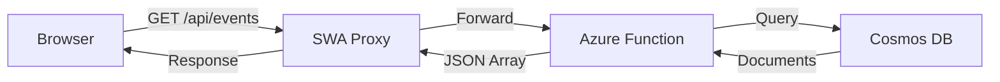
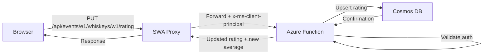
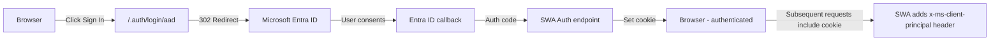
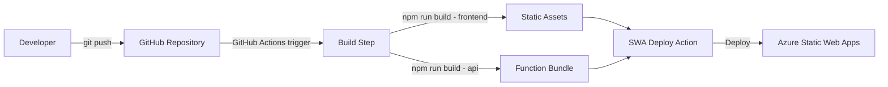

# WhiskyApp — Architecture Document

## 1. System Architecture Overview

### 1.1 High-Level Architecture

WhiskyApp follows a **serverless, JAMstack-inspired architecture** on Azure, optimizing for cost, simplicity, and scalability.

```
┌─────────────────────────────────────────────────────────────────┐
│                        AZURE CLOUD                              │
│                                                                 │
│  ┌──────────────────────────────────┐                           │
│  │   Azure Static Web Apps          │                           │
│  │  ┌────────────────────────────┐  │                           │
│  │  │  React SPA - Frontend     │  │                           │
│  │  │  - TypeScript + Vite      │  │                           │
│  │  │  - Built-in Auth          │  │                           │
│  │  └────────────┬───────────────┘  │                           │
│  │               │                  │                           │
│  │  ┌────────────▼───────────────┐  │                           │
│  │  │  Managed Azure Functions   │  │                           │
│  │  │  - API Routes /api/*      │  │                           │
│  │  │  - Node.js + TypeScript   │  │                           │
│  │  └────────────┬───────────────┘  │                           │
│  └───────────────│──────────────────┘                           │
│                  │                                               │
│  ┌───────────────▼──────────────────┐                           │
│  │   Azure Cosmos DB                │                           │
│  │   - NoSQL Document Store         │                           │
│  │   - Serverless Capacity Mode     │                           │
│  │   - whiskyapp database           │                           │
│  │     ├── events container         │                           │
│  │     ├── whiskeys container       │                           │
│  │     ├── eventWhiskeys container  │                           │
│  │     └── ratings container        │                           │
│  └──────────────────────────────────┘                           │
│                                                                 │
│  ┌──────────────────────────────────┐                           │
│  │   Microsoft Entra ID             │                           │
│  │   - Pre-configured SWA Auth      │                           │
│  └──────────────────────────────────┘                           │
└─────────────────────────────────────────────────────────────────┘
```

### 1.2 Request Flow



---

## 2. Technology Stack Decisions

### 2.1 Frontend — React + TypeScript + Vite

| Aspect | Decision |
|--------|----------|
| **Framework** | React 18+ |
| **Language** | TypeScript — strict mode |
| **Build Tool** | Vite — fast dev server and optimized builds |
| **Styling** | CSS Modules or Tailwind CSS — decision deferred to implementation |
| **State Management** | React Query / TanStack Query for server state; React Context for auth state |
| **Routing** | React Router v6 |

**Rationale**: React is the most widely adopted frontend framework with excellent TypeScript support. Vite provides significantly faster development experience compared to Create React App. Azure Static Web Apps has first-class support for React SPAs.

### 2.2 Backend — Azure Functions via Static Web Apps Managed Functions

| Aspect | Decision |
|--------|----------|
| **Runtime** | Node.js 20 LTS |
| **Language** | TypeScript |
| **Framework** | Azure Functions v4 programming model |
| **Hosting** | Managed Functions within Azure Static Web Apps |

**Rationale**: Azure Static Web Apps includes managed Azure Functions at no additional cost on the Free tier. This eliminates the need for a separate Azure Functions resource or App Service, reducing both cost and operational complexity. The `/api/*` route is automatically proxied to the functions, handling CORS and authentication seamlessly.

**Why not standalone Azure Functions or App Service?**
- Standalone Azure Functions would require a separate resource and configuration for CORS and auth
- App Service has a minimum cost even when idle — not cost-effective for MVP
- SWA managed functions provide the simplest deployment model — single `swa deploy` command

### 2.3 Database — Azure Cosmos DB with NoSQL API

| Aspect | Decision |
|--------|----------|
| **Service** | Azure Cosmos DB |
| **API** | NoSQL — Core SQL API |
| **Capacity Mode** | Serverless — pay per request |
| **Consistency** | Session consistency — default |

**Rationale**: Cosmos DB serverless mode charges only for consumed RUs — request units — making it extremely cost-effective for low-traffic MVP scenarios. The flexible schema accommodates evolving data models without migrations. The NoSQL API provides familiar SQL-like query syntax.

**Why not Azure SQL Database?**
- Azure SQL has a minimum monthly cost of ~$5/month even on the Basic tier
- Requires schema migrations for model changes
- Relational model is overkill for this simple domain
- Cosmos DB serverless can cost under $1/month for MVP traffic levels

### 2.4 Authentication — Azure Static Web Apps Built-in Auth

| Aspect | Decision |
|--------|----------|
| **Provider** | Azure Static Web Apps built-in authentication |
| **OAuth Provider** | Microsoft Entra ID |
| **Session Management** | SWA-managed cookies |
| **Role Management** | SWA role assignments via `staticwebapp.config.json` |

**Rationale**: Azure Static Web Apps provides built-in authentication with zero additional configuration cost. It handles the OAuth flow, session management, and provides user identity to the API functions via request headers. Entra ID is a pre-configured provider available on the Free SKU, eliminating the need for separate app registration or custom provider setup.

**Why not Azure AD B2C?**
- AD B2C requires a separate tenant, custom policies, and user flows — significant setup complexity
- AD B2C has a cost per authentication — first 50K/month free, but adds operational overhead
- SWA built-in auth with Entra ID is simpler, free, and sufficient for MVP
- Can migrate to AD B2C later if more providers or advanced flows are needed

**Admin Role Assignment**: Admin users are configured in the Azure Static Web Apps portal by assigning the `admin` role to specific Entra ID-authenticated user identities. This is managed through the SWA invitation system or via the Azure portal.

### 2.5 Hosting — Azure Static Web Apps

| Aspect | Decision |
|--------|----------|
| **Plan** | Free tier — sufficient for MVP |
| **Custom Domain** | Optional — Azure-provided domain for MVP |
| **SSL** | Automatic — included with SWA |
| **CI/CD** | GitHub Actions — auto-configured by SWA |

**Rationale**: Azure Static Web Apps Free tier includes hosting, managed functions, built-in auth, custom domains, and SSL — all at zero cost. This is the most cost-effective option for an MVP.

### 2.6 Technology Stack Summary

```
160: ┌─────────────────────────────────────────────┐
161: │              Technology Stack                │
162: ├─────────────────────────────────────────────┤
163: │  Frontend                                    │
164: │  ├── React 18+                               │
165: │  ├── TypeScript - strict                     │
166: │  ├── Vite                                    │
167: │  ├── React Router v6                         │
168: │  ├── TanStack Query                          │
169: │  └── CSS Modules or Tailwind CSS             │
170: ├─────────────────────────────────────────────┤
171: │  Backend                                     │
172: │  ├── Azure Functions v4                      │
173: │  ├── Node.js 20 LTS                          │
174: │  ├── TypeScript                              │
175: │  └── @azure/cosmos SDK                       │
176: ├─────────────────────────────────────────────┤
177: │  Data                                        │
178: │  ├── Azure Cosmos DB - NoSQL API             │
179: │  └── Serverless capacity mode                │
180: ├─────────────────────────────────────────────┤
181: │  Auth                                        │
182: │  ├── Azure SWA built-in auth                 │
183: │  └── Microsoft Entra ID provider             │
184: ├─────────────────────────────────────────────┤
185: │  Infrastructure                              │
186: │  ├── Azure Static Web Apps - Free tier       │
187: │  ├── GitHub Actions - CI/CD                  │
188: │  └── Azure Cosmos DB - Serverless            │
189: └─────────────────────────────────────────────┘
```

---

## 3. Component Architecture

### 3.1 Frontend Component Tree

```
App
├── Layout
│   ├── Header
│   │   ├── Logo
│   │   ├── Navigation
│   │   └── AuthButton - sign in/out + user info
│   └── Main - route outlet
├── Pages
│   ├── EventListPage
│   │   ├── EventCard - repeated for each event
│   │   └── CreateEventForm - admin only
│   ├── EventDetailPage
│   │   ├── EventHeader - name, date, edit/delete for admin
│   │   ├── WhiskeyList
│   │   │   └── WhiskeyCard - repeated for each whiskey
│   │   │       ├── WhiskeyInfo - name, distillery, age, type
│   │   │       ├── AverageRating - overall rating display
│   │   │       ├── UserRating - current user rating with controls
│   │   │       └── RatingCount - total number of ratings
│   │   └── AddWhiskeyForm - admin only
│   └── NotFoundPage
└── Providers
    ├── AuthProvider - user context from SWA auth
    └── QueryClientProvider - TanStack Query
```

### 3.2 Backend Function Structure

```
api/
├── src/
│   ├── functions/
│   │   ├── events.ts      — GET/POST /api/events
│   │   │                    GET/PUT/DELETE /api/events/:eventId
│   │   ├── whiskeys.ts    — GET/POST /api/whiskeys (catalog)
│   │   │                    GET/PATCH/DELETE /api/whiskeys/:whiskeyId
│   │   │                    GET/POST /api/events/:eventId/whiskeys (event links)
│   │   │                    GET/DELETE /api/events/:eventId/whiskeys/:whiskeyId
│   │   └── ratings.ts     — GET /api/events/:eventId/whiskeys/:whiskeyId/ratings
│   │                        PUT/DELETE /api/events/:eventId/whiskeys/:whiskeyId/ratings/me
│   └── lib/
│       ├── cosmos.ts      — getContainer() — routes to mock or real Cosmos DB
│       ├── cosmos.mock.ts — MockContainer + seed data
│       ├── auth.ts        — getClientPrincipal, requireTaster, isAdmin, getUserDisplayName
│       ├── response.ts    — ok, created, noContent, notFound, handleError helpers
│       └── aggregates.ts  — recomputeEventAggregate, recomputeGlobalAggregate
├── host.json
├── local.settings.json
├── package.json
└── tsconfig.json
```

---

## 4. Data Flow

### 4.1 Read Flow — Browse Events and Whiskeys



### 4.2 Write Flow — Rate a Whiskey



### 4.3 Auth Flow — Microsoft Entra ID Sign-In



---

## 5. API Design Overview

### 5.1 RESTful Endpoints

**Events**

| Method | Path | Auth | Role | Description |
|--------|------|------|------|-------------|
| `GET` | `/api/events` | None | All | List all events |
| `POST` | `/api/events` | Required | Admin | Create a new event |
| `GET` | `/api/events/:eventId` | None | All | Get event details |
| `PUT` | `/api/events/:eventId` | Required | Admin | Update event |
| `DELETE` | `/api/events/:eventId` | Required | Admin | Delete event |

**Catalog whiskeys** (global, not event-scoped)

| Method | Path | Auth | Role | Description |
|--------|------|------|------|-------------|
| `GET` | `/api/whiskeys` | None | All | List catalog whiskeys by global avg rating |
| `POST` | `/api/whiskeys` | Required | Taster | Create catalog whiskey |
| `GET` | `/api/whiskeys/:whiskeyId` | None | All | Get single catalog whiskey |
| `PATCH` | `/api/whiskeys/:whiskeyId` | Required | Taster | Update catalog whiskey (creator/admin) |
| `DELETE` | `/api/whiskeys/:whiskeyId` | Required | Taster | Delete catalog whiskey (creator/admin; 409 if linked) |

**Event ↔ whiskey links**

| Method | Path | Auth | Role | Description |
|--------|------|------|------|-------------|
| `GET` | `/api/events/:eventId/whiskeys` | None | All | List event whiskeys (joined, event-scoped avg) |
| `POST` | `/api/events/:eventId/whiskeys` | Required | Taster | Add whiskey to event (link existing or create+link) |
| `GET` | `/api/events/:eventId/whiskeys/:whiskeyId` | Required | Taster | Get single event whiskey |
| `DELETE` | `/api/events/:eventId/whiskeys/:whiskeyId` | Required | Taster | Remove whiskey from event (link only; creator/admin) |

**Ratings** (event-scoped)

| Method | Path | Auth | Role | Description |
|--------|------|------|------|-------------|
| `GET` | `/api/events/:eventId/whiskeys/:whiskeyId/ratings` | Required | Taster | List ratings for whiskey in this event |
| `PUT` | `/api/events/:eventId/whiskeys/:whiskeyId/ratings/me` | Required | Taster | Upsert own rating |
| `DELETE` | `/api/events/:eventId/whiskeys/:whiskeyId/ratings/me` | Required | Taster | Delete own rating |

### 5.2 API Conventions

- **Content-Type**: `application/json` for all requests and responses
- **Error Format**: `{ "error": { "code": "NOT_FOUND", "message": "Event not found" } }`
- **Status Codes**: 200 — success, 201 — created, 204 — no content, 400 — bad request, 401 — unauthorized, 403 — forbidden, 404 — not found, 500 — server error
- **Pagination**: Not needed for MVP — event and whiskey counts are small

---

## 6. Security Architecture

### 6.1 Authentication Layer

```
┌─────────────────────────────────────────────┐
│  Azure Static Web Apps Authentication       │
│                                              │
│  /.auth/login/aad   → Initiate OAuth        │
│  /.auth/logout      → Clear session         │
│  /.auth/me          → Get current user      │
│                                              │
│  Cookie-based session management             │
│  x-ms-client-principal header to API         │
└─────────────────────────────────────────────┘
```

### 6.2 Authorization Model

```
staticwebapp.config.json:
  /api/events          GET    → anonymous
  /api/events          POST   → admin
  /api/events/*        GET    → anonymous
  /api/events/*        PUT    → admin
  /api/events/*        DELETE → admin, authenticated
  /api/events/*/rating PUT    → authenticated
  /api/events/*/rating DELETE → authenticated
```

Authorization is enforced at two levels:
1. **Route-level**: `staticwebapp.config.json` restricts routes by role
2. **Function-level**: API functions validate the `x-ms-client-principal` header and check roles programmatically

### 6.3 Security Principles

- **Defense in depth**: Auth checked at both SWA route config and function code
- **Least privilege**: Anonymous users get read-only; authenticated users can only manage their own ratings
- **No secrets in client**: All sensitive configuration in Azure Function app settings
- **Input validation**: All API inputs validated before processing
- **HTTPS only**: Enforced by Azure Static Web Apps

---

## 7. Azure Resource Architecture

### 7.1 Resource Group Layout

```
rg-whiskyapp-dev
├── Azure Static Web Apps    — swa-whiskyapp-dev
│   ├── Frontend hosting     — React SPA
│   ├── Managed Functions    — API endpoints
│   └── Built-in Auth        — Microsoft Entra ID
└── Azure Cosmos DB Account  — cosmos-whiskyapp-dev
    └── Database: whiskyapp
        ├── Container: events         (pk: /id)
        ├── Container: whiskeys       (pk: /id)
        ├── Container: eventWhiskeys  (pk: /eventId)
        └── Container: ratings        (pk: /eventId)
```

### 7.2 Estimated Monthly Cost — MVP

| Resource | Tier | Estimated Cost |
|----------|------|----------------|
| Azure Static Web Apps | Free | $0 |
| Azure Cosmos DB | Serverless | $0–2/month at MVP traffic |
| **Total** | | **$0–2/month** |

### 7.3 Environment Strategy

| Environment | Purpose | Resources |
|-------------|---------|-----------|
| `dev` | Development and testing | Separate resource group |
| `prod` | Production | Separate resource group |

For MVP, a single environment — `dev` — is sufficient. Production environment is added when ready to launch.

---

## 8. Deployment Architecture

### 8.1 CI/CD Pipeline



### 8.2 Repository Structure

```
WhiskyApp/
├── .github/
│   └── workflows/
│       └── azure-static-web-apps.yml
├── src/                          — Frontend source
│   ├── components/
│   ├── pages/
│   ├── hooks/
│   ├── services/
│   ├── types/
│   ├── App.tsx
│   ├── main.tsx
│   └── index.html
├── api/                          — Azure Functions API
│   ├── src/
│   │   ├── functions/
│   │   ├── services/
│   │   ├── middleware/
│   │   ├── models/
│   │   └── utils/
│   ├── host.json
│   ├── local.settings.json
│   ├── package.json
│   └── tsconfig.json
├── staticwebapp.config.json      — SWA configuration
├── package.json                  — Frontend dependencies
├── tsconfig.json                 — Frontend TypeScript config
├── vite.config.ts                — Vite configuration
├── context/                      — Project documentation
└── README.md
```

---

## 9. Future Architecture Considerations

These are not part of the MVP but inform architectural decisions:

- **Image Storage**: Azure Blob Storage for whiskey bottle images — add when needed
- **Search**: Azure Cognitive Search for whiskey discovery — add when catalog grows
- **Caching**: Azure CDN or Redis Cache — add when traffic justifies it
- **Monitoring**: Azure Application Insights — add for production readiness
- **Multiple OAuth Providers**: Migrate to Azure AD B2C when needed
- **Real-time Updates**: Azure SignalR Service for live rating updates during events
