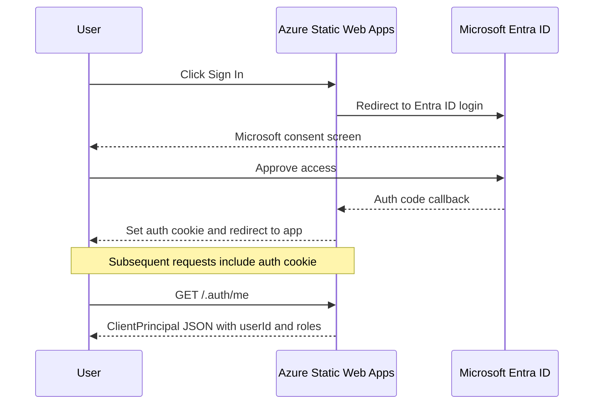
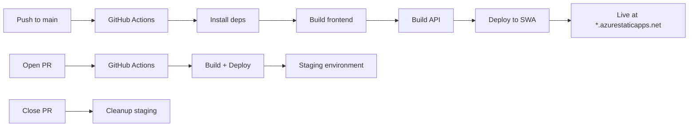

# WhiskyApp — Deployment Guide

Comprehensive guide for deploying and operating the WhiskyApp whisky tasting event rating application on Microsoft Azure.

---

## Table of Contents

1. [Prerequisites](#1-prerequisites)
2. [Azure Infrastructure Setup](#2-azure-infrastructure-setup)
3. [Entra ID Setup](#3-entra-id-setup)
4. [Admin Role Assignment](#4-admin-role-assignment)
5. [GitHub Actions CI/CD Setup](#5-github-actions-cicd-setup)
6. [Local Development Setup](#6-local-development-setup)
7. [Environment Variables Reference](#7-environment-variables-reference)
8. [Troubleshooting](#8-troubleshooting)
9. [Monitoring and Operations](#9-monitoring-and-operations)

---

## 1. Prerequisites

Before starting, ensure you have the following installed and configured:

### Required Software

| Tool | Version | Purpose |
|------|---------|---------|
| **Node.js** | 20 LTS or later | Runtime for frontend and API |
| **npm** | 10+ (bundled with Node.js) | Package management |
| **Azure CLI** | Latest | Azure resource management |
| **Azure Functions Core Tools** | v4 | Local API development and testing |
| **Git** | Latest | Version control |

### Required Accounts

| Account | Purpose |
|---------|---------|
| **Azure** | Cloud hosting — [portal.azure.com](https://portal.azure.com) |
| **GitHub** | Source code repository and CI/CD |
| **Microsoft Account** | Entra ID sign-in (work/school or personal Microsoft account) |

### Install Azure CLI

```bash
# Windows (winget)
winget install -e --id Microsoft.AzureCLI

# macOS (Homebrew)
brew install azure-cli

# Verify installation
az --version
az login
```

### Install Azure Functions Core Tools v4

```bash
# Windows (winget)
winget install -e --id Microsoft.Azure.FunctionsCoreTools

# macOS (Homebrew)
brew tap azure/functions
brew install azure-functions-core-tools@4

# npm (cross-platform)
npm install -g azure-functions-core-tools@4 --unsafe-perm true

# Verify installation
func --version
```

---

## 2. Azure Infrastructure Setup

### 2.1 Create Resource Group

All Azure resources should be grouped together for easy management and cost tracking.

```bash
# Login to Azure
az login

# Set your preferred subscription (if you have multiple)
az account set --subscription "Your Subscription Name"

# Create resource group
az group create \
  --name rg-whiskyapp \
  --location northeurope
```

> **Tip**: Choose a region close to your users. Common options: `northeurope`, `westeurope`, `eastus`, `westus2`.

### 2.2 Create Azure Cosmos DB Account (Serverless)

#### Create the Cosmos DB account

```bash
# Create Cosmos DB account with serverless capacity
az cosmosdb create \
  --name cosmos-whiskyapp \
  --resource-group rg-whiskyapp \
  --kind GlobalDocumentDB \
  --capabilities EnableServerless \
  --default-consistency-level Session \
  --locations regionName=northeurope failoverPriority=0 isZoneRedundant=false
```

> **Note**: The account name must be globally unique. Replace `cosmos-whiskyapp` with a unique name if needed (e.g., `cosmos-whiskyapp-yourname`).

#### Create the database

```bash
az cosmosdb sql database create \
  --account-name cosmos-whiskyapp \
  --resource-group rg-whiskyapp \
  --name whiskyapp
```

#### Create the three containers

```bash
# Events container — partition key: /id
az cosmosdb sql container create \
  --account-name cosmos-whiskyapp \
  --resource-group rg-whiskyapp \
  --database-name whiskyapp \
  --name events \
  --partition-key-path "/id"

# Whiskeys container — partition key: /eventId
az cosmosdb sql container create \
  --account-name cosmos-whiskyapp \
  --resource-group rg-whiskyapp \
  --database-name whiskyapp \
  --name whiskeys \
  --partition-key-path "/eventId"

# Ratings container — partition key: /whiskeyId
az cosmosdb sql container create \
  --account-name cosmos-whiskyapp \
  --resource-group rg-whiskyapp \
  --database-name whiskyapp \
  --name ratings \
  --partition-key-path "/whiskeyId"
```

#### Retrieve connection credentials

```bash
# Get the endpoint URL
az cosmosdb show \
  --name cosmos-whiskyapp \
  --resource-group rg-whiskyapp \
  --query documentEndpoint \
  --output tsv

# Get the primary key
az cosmosdb keys list \
  --name cosmos-whiskyapp \
  --resource-group rg-whiskyapp \
  --query primaryMasterKey \
  --output tsv
```

Save these values — you will need them for:
- GitHub Actions secrets
- Azure Static Web Apps application settings
- Local development configuration

### 2.3 Create Azure Static Web Apps Resource

#### Option A: Via Azure Portal (Recommended for first-time setup)

1. Go to [Azure Portal](https://portal.azure.com)
2. Click **Create a resource** → search for **Static Web Apps**
3. Click **Create** and fill in:
   - **Subscription**: Your subscription
   - **Resource Group**: `rg-whiskyapp`
   - **Name**: `swa-whiskyapp`
   - **Plan type**: Free
   - **Region**: Choose closest to your users
   - **Source**: GitHub
   - **Organization**: Your GitHub org/username
   - **Repository**: Your WhiskyApp repository
   - **Branch**: `main`
4. In **Build Details**:
   - **Build Preset**: Custom
   - **App location**: `frontend`
   - **Api location**: `api`
   - **Output location**: `dist`
5. Click **Review + create** → **Create**

> **Important**: Azure will automatically create a GitHub Actions workflow file in your repository. If you already have `.github/workflows/azure-static-web-apps.yml`, you may need to reconcile the auto-generated workflow with the existing one.

#### Option B: Via Azure CLI

```bash
az staticwebapp create \
  --name swa-whiskyapp \
  --resource-group rg-whiskyapp \
  --source https://github.com/YOUR_USERNAME/WhiskyApp \
  --location northeurope \
  --branch main \
  --app-location "frontend" \
  --api-location "api" \
  --output-location "dist" \
  --login-with-github
```

### 2.4 Configure Application Settings

Set the Cosmos DB credentials as application settings for the Azure Functions managed by SWA:

```bash
# Set Cosmos DB endpoint
az staticwebapp appsettings set \
  --name swa-whiskyapp \
  --resource-group rg-whiskyapp \
  --setting-names \
    COSMOS_ENDPOINT=https://cosmos-whiskyapp.documents.azure.com:443/ \
    COSMOS_KEY=your-cosmos-primary-key \
    COSMOS_DATABASE=whiskyapp
```

> **Security Note**: Application settings are encrypted at rest and injected as environment variables into the Azure Functions runtime. They are not exposed to the frontend.

---

## 3. Entra ID Setup

Entra ID (formerly Azure Active Directory) is a **pre-configured identity provider** on Azure Static Web Apps Free SKU. No separate app registration or client credentials are required for the default multitenant setup.

### 3.1 How It Works

- **Login URL**: `/.auth/login/aad`
- **Supported accounts**: Any Microsoft account (personal or work/school)
- **No client ID/secret required** for the pre-configured provider
- **Admin role management**: Built-in SWA invitation system via Azure Portal

### 3.2 Optional: Single Tenant Restriction

The pre-configured provider allows any Microsoft account to sign in. To restrict authentication to a specific Azure AD tenant:

1. Register an application in [Azure Portal](https://portal.azure.com) → **App registrations**
2. Configure authentication settings (redirect URIs, etc.)
3. Note the Application (client) ID and Directory (tenant) ID
4. Configure via `staticwebapp.config.json` `auth.identityProviders.azureActiveDirectory`

> **Note**: Single-tenant configuration via `staticwebapp.config.json` is a **Standard SKU feature**. On the Free SKU, the pre-configured multitenant provider is used as-is.

### 3.3 Auth Flow Summary



---

## 4. Admin Role Assignment

Azure Static Web Apps uses a role-based access control system. All authenticated users automatically receive the `authenticated` role. The `admin` role must be explicitly assigned.

### 4.1 Invite Users as Admin

1. Go to [Azure Portal](https://portal.azure.com)
2. Navigate to your Static Web App resource (`swa-whiskyapp`)
3. In the left menu, click **Settings** → **Role management**
4. Click **Invite**
5. Fill in:
   - **Identity provider**: Microsoft
   - **Invitee email**: The email address of the admin user (Entra ID UPN)
   - **Role**: `admin`
   - **Invitation expiry**: Set an appropriate expiry (e.g., 8 hours)
6. Click **Generate invitation link**
7. Send the invitation link to the user — they must click it while signed in with their Microsoft account to accept the role

### 4.2 Role Hierarchy

| Role | Access Level | How Assigned |
|------|-------------|--------------|
| `anonymous` | Read-only — browse events and whiskeys | Automatic for all visitors |
| `authenticated` | Rate whiskeys — create, update, delete own ratings | Automatic upon Microsoft sign-in |
| `admin` | Full access — manage events and whiskeys | Manual invitation via Azure Portal |

### 4.3 Verify Role Assignment

After a user accepts the admin invitation, they can verify their roles by visiting:
```
https://<your-swa-domain>/.auth/me
```

The response will include `userRoles` containing both `authenticated` and `admin`.

---

## 5. GitHub Actions CI/CD Setup

The project includes a pre-configured GitHub Actions workflow at `.github/workflows/azure-static-web-apps.yml`.

### 6.1 Get the SWA Deployment Token

```bash
# Via Azure CLI
az staticwebapp secrets list \
  --name swa-whiskyapp \
  --resource-group rg-whiskyapp \
  --query properties.apiKey \
  --output tsv
```

Or via Azure Portal:
1. Navigate to your Static Web App resource
2. Click **Settings** → **Manage deployment token**
3. Copy the token

### 6.2 Configure GitHub Secrets

Navigate to your GitHub repository → **Settings** → **Secrets and variables** → **Actions** → **New repository secret**

Add the following secrets:

| Secret Name | Value | Description |
|-------------|-------|-------------|
| `AZURE_STATIC_WEB_APPS_API_TOKEN` | SWA deployment token | Required for deployment |
| `COSMOS_DB_ENDPOINT` | `https://cosmos-whiskyapp.documents.azure.com:443/` | Cosmos DB endpoint |
| `COSMOS_DB_KEY` | Your Cosmos DB primary key | Cosmos DB authentication |
| `COSMOS_DB_DATABASE` | `whiskyapp` | Database name |

> **Note**: The workflow file references these secrets with the `COSMOS_DB_` prefix. The Azure Functions runtime receives them as environment variables. The API code reads `COSMOS_ENDPOINT`, `COSMOS_KEY`, and `COSMOS_DATABASE` — ensure the SWA application settings (Section 2.4) use the correct names that match the code.

### 6.3 Trigger Deployment

Push to the `main` branch to trigger the CI/CD pipeline:

```bash
git add .
git commit -m "Configure deployment"
git push origin main
```

The workflow will:
1. Check out the code
2. Install frontend and API dependencies
3. Build the frontend (`npm run build` in `frontend/`)
4. Build the API (`npm run build` in `api/`)
5. Deploy the pre-built artifacts to Azure Static Web Apps

### 6.4 Monitor Deployment

- Go to your GitHub repository → **Actions** tab to view workflow runs
- Each push to `main` triggers a build and deploy
- Pull requests create staging environments with preview URLs

### 6.5 Workflow Architecture



---

## 6. Local Development Setup

### 7.1 Clone and Install

```bash
# Clone the repository
git clone https://github.com/YOUR_USERNAME/WhiskyApp.git
cd WhiskyApp

# Install frontend dependencies
cd frontend
npm install

# Install API dependencies
cd ../api
npm install

# Return to project root
cd ..
```

### 7.2 Configure Environment Variables

#### API Configuration

```bash
# Copy the example settings file
cp api/local.settings.json.example api/local.settings.json
```

Edit `api/local.settings.json` with your Cosmos DB credentials:

```json
{
  "IsEncrypted": false,
  "Values": {
    "AzureWebJobsStorage": "UseDevelopmentStorage=true",
    "FUNCTIONS_WORKER_RUNTIME": "node",
    "COSMOS_ENDPOINT": "https://your-account.documents.azure.com:443/",
    "COSMOS_KEY": "your-cosmos-primary-key",
    "COSMOS_DATABASE": "whiskyapp"
  }
}
```

#### Frontend Configuration

```bash
# Copy the example env file
cp .env.example frontend/.env.local
```

The default `VITE_API_BASE_URL=http://localhost:7071/api` is correct for local development. However, the Vite dev server is configured with a proxy in `frontend/vite.config.ts` that forwards `/api` requests to `http://localhost:7071`, so the frontend API client should use relative URLs (e.g., `/api/events`) in development.

### 7.3 Start Development Servers

#### Option A: Start both servers together (from project root)

```bash
npm run dev
```

This uses `concurrently` to start both the frontend Vite dev server and the Azure Functions runtime.

#### Option B: Start servers separately (in two terminals)

**Terminal 1 — API:**
```bash
cd api
npm run dev
```
This runs `func start` which starts the Azure Functions runtime on `http://localhost:7071`.

**Terminal 2 — Frontend:**
```bash
cd frontend
npm run dev
```
This starts the Vite dev server on `http://localhost:5173`.

### 7.4 Access the Application

- **Frontend**: [http://localhost:5173](http://localhost:5173)
- **API directly**: [http://localhost:7071/api/events](http://localhost:7071/api/events)

### 7.5 Authentication in Local Development

> **Important**: Azure Static Web Apps built-in authentication does **not** work in local development. The `/.auth/login/aad` and `/.auth/me` endpoints are only available when the app is deployed to Azure.

For local testing, you have two options:

#### Option 1: Use SWA CLI (Recommended)

The SWA CLI can emulate the authentication flow locally:

```bash
# Install SWA CLI globally
npm install -g @azure/static-web-apps-cli

# Start with auth emulation
swa start http://localhost:5173 --api-location ./api
```

The SWA CLI provides a mock login page at `http://localhost:4280/.auth/login/aad` where you can enter test user details.

#### Option 2: Mock the Auth Header

For API-only testing, you can send a mock `x-ms-client-principal` header. Create a base64-encoded JSON payload:

```javascript
// Example: Create a mock admin user header
const principal = {
  userId: "test-user-123",
  userRoles: ["anonymous", "authenticated", "admin"],
  claims: [{ typ: "name", val: "Test Admin" }],
  identityProvider: "google",
  userDetails: "admin@example.com"
};
const header = Buffer.from(JSON.stringify(principal)).toString('base64');
console.log(header);
// Use this value as the x-ms-client-principal header in API requests
```

```bash
# Example curl request with mock auth
curl -H "x-ms-client-principal: <base64-encoded-value>" \
  http://localhost:7071/api/events
```

### 7.6 Build for Production (Local Verification)

```bash
# Build everything from root
npm run build

# Or build individually
cd frontend && npm run build   # Output: frontend/dist/
cd ../api && npm run build     # Output: api/dist/
```

---

## 7. Environment Variables Reference

### 7.1 API Environment Variables (Azure Functions)

| Variable | Required | Default | Description | Example |
|----------|----------|---------|-------------|---------|
| `COSMOS_ENDPOINT` | Yes | — | Azure Cosmos DB account endpoint URL | `https://cosmos-whiskyapp.documents.azure.com:443/` |
| `COSMOS_KEY` | Yes | — | Azure Cosmos DB primary or secondary key | `abc123...` |
| `COSMOS_DATABASE` | No | `whiskyapp` | Cosmos DB database name | `whiskyapp` |
| `FUNCTIONS_WORKER_RUNTIME` | Yes | — | Azure Functions runtime (set automatically) | `node` |
| `AzureWebJobsStorage` | Local only | — | Storage connection for local dev | `UseDevelopmentStorage=true` |

### 7.2 Frontend Environment Variables (Vite)

| Variable | Required | Default | Description | Example |
|----------|----------|---------|-------------|---------|
| `VITE_API_BASE_URL` | No | `/api` | API base URL — only needed if API is on a different origin | `http://localhost:7071/api` |

> **Note**: Vite environment variables must be prefixed with `VITE_` to be exposed to the frontend bundle. Never put secrets in `VITE_` variables — they are embedded in the client-side JavaScript.

### 7.3 GitHub Actions Secrets

| Secret | Required | Description |
|--------|----------|-------------|
| `AZURE_STATIC_WEB_APPS_API_TOKEN` | Yes | SWA deployment token from Azure Portal |
| `COSMOS_DB_ENDPOINT` | Yes | Cosmos DB endpoint — passed to deployment |
| `COSMOS_DB_KEY` | Yes | Cosmos DB key — passed to deployment |
| `COSMOS_DB_DATABASE` | No | Database name — defaults to `whiskyapp` |
| `GITHUB_TOKEN` | Auto | Automatically provided by GitHub Actions |

### 7.4 Azure Static Web Apps Application Settings

These are configured via Azure Portal or CLI (Section 2.4) and are injected into the Azure Functions runtime:

| Setting | Value |
|---------|-------|
| `COSMOS_ENDPOINT` | Your Cosmos DB endpoint URL |
| `COSMOS_KEY` | Your Cosmos DB primary key |
| `COSMOS_DATABASE` | `whiskyapp` |

### 7.5 Where Each Variable Is Set

```
┌─────────────────────────────────────────────────────────────┐
│  Environment Variable Flow                                   │
├─────────────────────────────────────────────────────────────┤
│                                                              │
│  Local Development:                                          │
│    api/local.settings.json  →  Azure Functions runtime       │
│    frontend/.env.local      →  Vite build                    │
│                                                              │
│  CI/CD Pipeline:                                             │
│    GitHub Secrets           →  GitHub Actions workflow        │
│                              →  SWA deployment               │
│                                                              │
│  Production:                                                 │
│    SWA Application Settings →  Azure Functions runtime       │
│    (set via Azure Portal or CLI)                             │
│                                                              │
└─────────────────────────────────────────────────────────────┘
```

---

## 8. Troubleshooting

### 9.1 CORS Errors in Local Development

**Symptom**: Browser console shows `Access-Control-Allow-Origin` errors when frontend calls the API.

**Cause**: The frontend dev server (port 5173) and API (port 7071) are on different origins.

**Solution**: The Vite dev server is configured with a proxy in `frontend/vite.config.ts` that forwards `/api` requests to `http://localhost:7071`. Ensure:
- Your API client uses relative URLs like `/api/events` (not `http://localhost:7071/api/events`)
- The Vite proxy configuration is intact:
  ```typescript
  server: {
    proxy: {
      '/api': {
        target: 'http://localhost:7071',
        changeOrigin: true,
      },
    },
  }
  ```

### 9.2 Authentication Not Working Locally

**Symptom**: `/.auth/login/aad` returns 404 or the auth flow does not complete.

**Cause**: Azure Static Web Apps built-in auth is a cloud-only feature. The `/.auth/*` endpoints are provided by the SWA infrastructure, not by your application code.

**Solution**:
- Use the **SWA CLI** to emulate auth locally (see Section 7.5)
- Or mock the `x-ms-client-principal` header for API testing
- Full auth testing requires deploying to Azure (even a PR staging environment works)

### 9.3 Cosmos DB Connection Failures

**Symptom**: API returns 500 errors with messages about Cosmos DB connection.

**Checks**:
1. Verify `COSMOS_ENDPOINT` and `COSMOS_KEY` are correctly set:
   - Locally: check `api/local.settings.json`
   - Production: check SWA Application Settings in Azure Portal
2. Ensure the Cosmos DB account firewall allows access:
   - Azure Portal → Cosmos DB → **Networking** → ensure "Accept connections from within public Azure datacenters" is checked
   - For local dev, ensure your IP is allowed or "Allow access from Azure portal" and "Allow access from all networks" are enabled
3. Verify the database and containers exist:
   ```bash
   az cosmosdb sql database list \
     --account-name cosmos-whiskyapp \
     --resource-group rg-whiskyapp
   ```

### 8.4 Azure Functions Not Starting Locally

**Symptom**: `npm run dev` in the `api/` directory fails or `func start` errors.

**Checks**:
1. Ensure Azure Functions Core Tools v4 is installed:
   ```bash
   func --version
   # Should output 4.x.x
   ```
2. Ensure `api/local.settings.json` exists (it is gitignored):
   ```bash
   cp api/local.settings.json.example api/local.settings.json
   ```
3. Ensure the API TypeScript is compiled:
   ```bash
   cd api
   npm run build
   npm run dev
   ```
4. Check that Node.js version is 20+:
   ```bash
   node --version
   ```

### 8.5 Build Failures

**Symptom**: `npm run build` fails in frontend or API.

**Frontend build issues**:
- TypeScript errors: Run `cd frontend && npx tsc --noEmit` to see type errors
- Missing dependencies: Run `cd frontend && npm install`
- Vite config issues: Check `frontend/vite.config.ts`

**API build issues**:
- TypeScript errors: Run `cd api && npx tsc --noEmit`
- Missing dependencies: Run `cd api && npm install`
- Ensure `api/tsconfig.json` output directory matches expectations

### 8.6 GitHub Actions Deployment Failures

**Symptom**: The GitHub Actions workflow fails.

**Checks**:
1. Verify all required secrets are set in GitHub repository settings
2. Check the workflow logs in GitHub → **Actions** tab
3. Ensure the SWA deployment token is valid:
   ```bash
   az staticwebapp secrets list \
     --name swa-whiskyapp \
     --resource-group rg-whiskyapp
   ```
4. If the token was regenerated, update the `AZURE_STATIC_WEB_APPS_API_TOKEN` secret in GitHub

### 8.7 404 Errors on Page Refresh (Client-Side Routing)

**Symptom**: Navigating directly to a URL like `/events/123` returns a 404.

**Cause**: The SPA uses client-side routing, but the server does not know about these routes.

**Solution**: The `staticwebapp.config.json` includes a `navigationFallback` rule that rewrites all non-API, non-asset requests to `index.html`. Verify this configuration is present:
```json
{
  "navigationFallback": {
    "rewrite": "/index.html",
    "exclude": ["/api/*", "/*.{css,scss,js,png,gif,ico,jpg,svg,woff,woff2}"]
  }
}
```

### 8.8 Staging Environments Not Cleaning Up

**Symptom**: Old PR staging environments persist after PRs are closed.

**Cause**: The `close_pull_request_job` in the workflow may not have run.

**Solution**: The workflow includes a cleanup job that runs when PRs are closed. If staging environments persist, manually close them:
```bash
az staticwebapp environment delete \
  --name swa-whiskyapp \
  --resource-group rg-whiskyapp \
  --environment-name <environment-name>
```

---

## 9. Monitoring and Operations

### 10.1 Application Insights

The API is pre-configured for Azure Application Insights integration via `api/host.json`:

```json
{
  "logging": {
    "applicationInsights": {
      "samplingSettings": {
        "isEnabled": true,
        "excludedTypes": "Request"
      }
    }
  }
}
```

To enable Application Insights:
1. Azure Portal → Static Web App → **Application Insights** (under Monitoring)
2. Click **Enable Application Insights**
3. This creates an Application Insights resource linked to your SWA

Once enabled, you can:
- View function execution logs
- Monitor request/response times
- Track failures and exceptions
- Set up alerts for error rates or latency

### 10.2 Viewing Function Logs

#### Via Azure Portal
1. Navigate to your Static Web App resource
2. Click **Functions** in the left menu
3. Click on a function name (e.g., `events`, `whiskeys`, `ratings`)
4. Click **Monitor** to view invocation logs

#### Via Azure CLI
```bash
# View recent function logs (requires Application Insights)
az monitor app-insights query \
  --app <app-insights-name> \
  --resource-group rg-whiskyapp \
  --analytics-query "traces | order by timestamp desc | take 50"
```

### 10.3 Cosmos DB Metrics and RU Consumption

Monitor database performance and costs:

1. Azure Portal → Cosmos DB account → **Metrics**
2. Key metrics to watch:
   - **Total Request Units** — cost of operations
   - **Total Requests** — volume of operations
   - **Document Count** — data growth
   - **Data Storage** — storage consumption

#### Check RU consumption via CLI
```bash
az cosmosdb sql container throughput show \
  --account-name cosmos-whiskyapp \
  --resource-group rg-whiskyapp \
  --database-name whiskyapp \
  --name events
```

### 9.4 Cost Estimation for MVP Traffic

| Resource | Pricing Model | Estimated Monthly Cost |
|----------|--------------|----------------------|
| **Azure Static Web Apps** | Free tier | $0 |
| **Azure Cosmos DB (Serverless)** | $0.25 per 1M RUs + $0.25/GB storage | < $1 for MVP traffic |
| **Application Insights** | 5 GB/month free ingestion | $0 for MVP |
| **Microsoft Entra ID** | Free (pre-configured provider) | $0 |
| **GitHub Actions** | 2,000 min/month free for public repos | $0 |
| **Total estimated** | | **< $1/month** |

> **Note**: Cosmos DB serverless charges per request unit consumed. A typical read operation costs 1-5 RUs. For an MVP with a few dozen users and occasional tasting events, monthly costs should be well under $1.

### 10.5 Custom Domain (Optional)

To add a custom domain to your Static Web App:

1. Azure Portal → Static Web App → **Custom domains**
2. Click **Add**
3. Enter your domain name
4. Configure DNS:
   - For apex domain: Add a CNAME or ALIAS record
   - For subdomain: Add a CNAME record pointing to your SWA URL
5. Azure will automatically provision an SSL certificate

```bash
# Via CLI
az staticwebapp hostname set \
  --name swa-whiskyapp \
  --resource-group rg-whiskyapp \
  --hostname yourdomain.com
```

> **Remember**: For custom domains, the Entra ID callback URI is automatically handled by SWA.

### 9.6 Backup and Recovery

#### Cosmos DB
- **Point-in-time restore**: Cosmos DB serverless supports continuous backup with 7-day retention (included at no extra cost)
- **Manual export**: Use Azure Data Factory or the Cosmos DB Data Migration Tool for manual backups

#### Application Code
- All code is in GitHub — the repository is the source of truth
- SWA deployments are immutable — you can roll back by redeploying a previous commit

### 9.7 Scaling Considerations

The current architecture is designed for MVP scale. If traffic grows significantly:

| Component | Current | Scale Path |
|-----------|---------|------------|
| **SWA** | Free tier (2 custom domains, 0.5 GB storage) | Standard tier ($9/month — more domains, storage, SLA) |
| **Cosmos DB** | Serverless | Provisioned throughput with autoscale for predictable workloads |
| **Functions** | SWA-managed | Standalone Azure Functions for more control and higher limits |

---

## Appendix: Quick Start Checklist

Use this checklist to track your deployment progress:

- [ ] Azure account created and CLI installed
- [ ] Resource group `rg-whiskyapp` created
- [ ] Cosmos DB account created (serverless)
- [ ] Database `whiskyapp` created
- [ ] Containers created: `events`, `whiskeys`, `ratings`
- [ ] Cosmos DB endpoint and key retrieved
- [ ] Azure Static Web App created and linked to GitHub
- [ ] Entra ID auth provider configured (pre-configured — no additional setup needed)
- [ ] SWA application settings configured (Cosmos DB credentials)
- [ ] GitHub secrets configured
- [ ] First deployment triggered (push to main)
- [ ] Admin role assigned to at least one user
- [ ] Smoke test: browse events, sign in, rate a whiskey
- [ ] Application Insights enabled (optional)
- [ ] Custom domain configured (optional)
